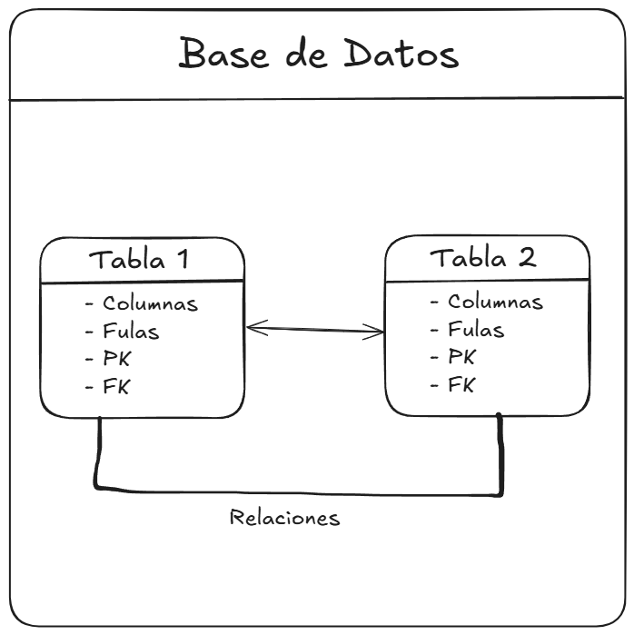
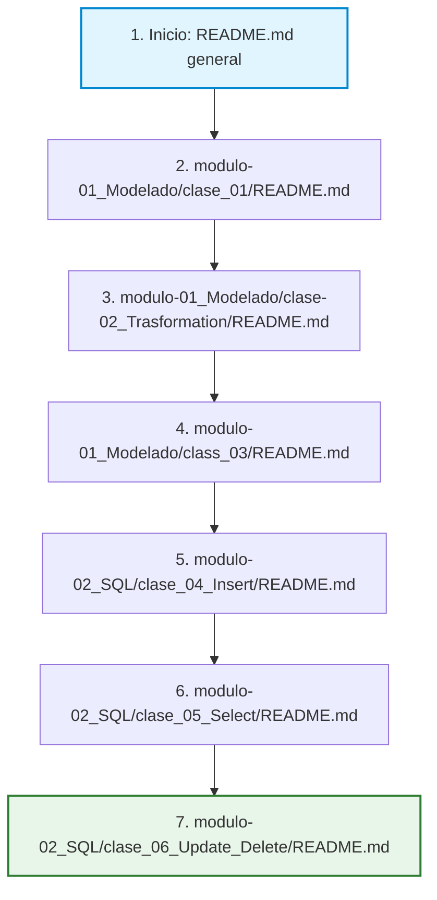

<div align="center">
  <h1>Bases de Datos Relacionales</h1>
  <p><em>Curso práctico: desde el diseño conceptual hasta las operaciones CRUD</em></p>
</div>

---

## Tabla de contenidos

| #   | Clase                                                     | Tema                                  |
| --- | --------------------------------------------------------- | ------------------------------------- |
| 1   | [Diagramas ER](./modulo-01_Modelado/clase_01/)            | Modelado Entidad-Relación con draw.io |
| 2   | [Transformación ER](./modulo-01_Modelado/clase-02_Trasformation/) | Del diagrama ER al esquema relacional |
| 3   | [DDL en SQL Server](./modulo-01_Modelado/class_03/)       | Crear tablas en SQL Server            |
| 4   | [Insertar datos](./modulo-02_SQL/clase_04_Insert/)        | INSERT INTO                           |
| 5   | [Consultas básicas](./modulo-02_SQL/clase_05_Select/)     | SELECT, WHERE, ORDER BY               |
| 6   | [Actualizar y eliminar](./modulo-02_SQL/clase_06_Update_Delete/) | UPDATE y DELETE                |

---

## ¿Qué son las bases de datos?

Una **base de datos** es un sistema organizado para almacenar, gestionar y recuperar información de manera estructurada. Funciona como un **almacén centralizado** donde se guardan datos relacionados entre sí, representando algún aspecto del mundo real.

**Ejemplo cotidiano:** Piensa en la lista de contactos de tu teléfono. Cada contacto tiene un nombre, un número y quizá un correo. Esa lista es una base de datos sencilla.

---

### Características fundamentales

| #   | Característica            | Descripción                                                                                                  |
| --- | ------------------------- | ------------------------------------------------------------------------------------------------------------ |
| 1   | **Persistencia**          | Los datos se mantienen almacenados de forma permanente, más allá del tiempo de ejecución de las aplicaciones |
| 2   | **Estructura organizada** | La información se organiza mediante modelos que facilitan su acceso y comprensión                            |
| 3   | **Gestión centralizada**  | Permite el control unificado de la información, evitando duplicidades                                        |
| 4   | **Independencia de datos** | Separa la forma en que se almacenan los datos de cómo los usan las aplicaciones                             |
| 5   | **Control de acceso**     | Proporciona mecanismos de seguridad para regular quién puede ver o modificar la información                  |

---

### ¿Por qué son importantes?

| Beneficio                                                           | Impacto                       |
| ------------------------------------------------------------------- | ----------------------------- |
| Preservan información de manera confiable y duradera                | Historial completo disponible |
| Permiten acceso concurrente a múltiples usuarios sin perder datos   | Escalabilidad garantizada     |
| Establecen relaciones entre diferentes tipos de información         | Modelos complejos posibles    |
| Optimizan el espacio mediante diseño que evita redundancias         | Eficiencia en almacenamiento  |
| Facilitan la consistencia mediante reglas de integridad             | Calidad de datos asegurada    |
| Posibilitan análisis sobre grandes volúmenes de datos               | Información valiosa generada  |

---

## Bases de datos relacionales: el modelo predominante

El **modelo relacional** es el más utilizado actualmente. Se basa en organizar los datos en **tablas** (filas y columnas), donde las tablas se conectan entre sí mediante **claves**.

### Elementos clave



| Elemento                 | Descripción                                           | Ejemplo                    |
| ------------------------ | ----------------------------------------------------- | -------------------------- |
| **Tablas (Relaciones)**  | Estructuras con filas y columnas                      | `Estudiantes`, `Cursos`    |
| **Filas (Tuplas)**       | Representan registros individuales                    | Un estudiante específico   |
| **Columnas (Atributos)** | Definen las propiedades de los datos                  | `Nombre`, `Edad`, `Email`  |
| **Claves Primarias**     | Identificadores únicos para cada fila                 | `IdEstudiante`             |
| **Claves Foráneas**      | Establecen relaciones entre tablas                    | `IdCurso` en `Estudiantes` |
| **Esquema**              | Define la estructura de las tablas y sus relaciones   | Diagrama completo de BD    |

### Ventajas del modelo relacional

| Ventaja               | Explicación                                       | Beneficio                      |
| ---------------------- | ------------------------------------------------- | ------------------------------ |
| **Intuitivo**          | La representación en tablas es fácil de entender  | Rápida curva de aprendizaje    |
| **Flexible**           | Permite modelar diversas situaciones del mundo real | Adaptable a múltiples dominios |
| **Estándar universal** | Utiliza SQL (Structured Query Language)           | Portabilidad entre sistemas    |
| **Consistencia**       | Aplica restricciones de integridad                | Datos confiables y precisos    |
| **Madurez**            | Más de 40 años de desarrollo y optimización       | Soluciones probadas y estables |

---

## SQL: el lenguaje estándar

**SQL (Structured Query Language)** es el lenguaje que se usa para comunicarse con bases de datos relacionales. Con SQL puedes crear tablas, insertar datos, consultarlos, actualizarlos y eliminarlos.

### ¿Qué permite SQL?

| Operación     | Comando SQL    | Propósito                     |
| ------------- | -------------- | ----------------------------- |
| **Crear**     | `CREATE`       | Estructuras de bases de datos |
| **Insertar**  | `INSERT`       | Agregar nuevos datos          |
| **Modificar** | `UPDATE`       | Actualizar datos existentes   |
| **Eliminar**  | `DELETE`       | Remover datos                 |
| **Consultar** | `SELECT`       | Recuperar información         |

### Ejemplo básico de una tabla relacional

_Nota: más adelante veremos cada uno de estos comandos a profundidad._

```sql
-- Creación de la tabla Estudiantes
CREATE TABLE Estudiantes (
    -- Clave primaria (identificador único)
    IdEstudiante INT PRIMARY KEY,

    -- Atributo obligatorio
    Nombre VARCHAR(50) NOT NULL,

    -- Clave foránea (relación con tabla Cursos y estilo de definición en línea)
    IdCurso INT FOREIGN KEY REFERENCES Cursos(IdCurso) ON DELETE CASCADE ON UPDATE CASCADE,

    -- Atributo con valor predeterminado
    Estado BIT DEFAULT 1
);
```

**Análisis de la estructura:**

- `PRIMARY KEY` - Garantiza unicidad de cada registro
- `NOT NULL` - Obliga a que el campo tenga valor
- `FOREIGN KEY` - Establece relación con otra tabla
- `REFERENCES` - Especifica la tabla y columna referenciada

---

## Ruta de aprendizaje y guía de archivos

Para estudiar este curso de forma óptima, debes seguir la siguiente secuencia de carpetas y archivos en el orden indicado:



### Detalle del orden de lectura paso a paso:

1. **[README.md (Raíz)](file:///c:/Users/Walter_Jiron/Documents/Proyectos/Learn_DB/README.md)**: Lee este archivo primero para comprender los conceptos teóricos iniciales de las bases de datos y el modelo relacional.
2. **[clase_01/README.md (Diagramas ER)](file:///c:/Users/Walter_Jiron/Documents/Proyectos/Learn_DB/modulo-01_Modelado/clase_01/README.md)**: Aprende el modelado conceptual diseñando diagramas en draw.io.
3. **[clase-02_Trasformation/README.md (Transformación)](file:///c:/Users/Walter_Jiron/Documents/Proyectos/Learn_DB/modulo-01_Modelado/clase-02_Trasformation/README.md)**: Revisa las reglas para pasar del diseño gráfico a un esquema lógico relacional (tablas).
4. **[class_03/README.md (DDL)](file:///c:/Users/Walter_Jiron/Documents/Proyectos/Learn_DB/modulo-01_Modelado/class_03/README.md)**: Comienza a programar en SQL Server creando la base de datos y sus tablas relacionales.
5. **[clase_04_Insert/README.md (INSERT)](file:///c:/Users/Walter_Jiron/Documents/Proyectos/Learn_DB/modulo-02_SQL/clase_04_Insert/README.md)**: Inserta tus primeros registros siguiendo la jerarquía y restricciones de llaves foráneas.
6. **[clase_05_Select/README.md (SELECT)](file:///c:/Users/Walter_Jiron/Documents/Proyectos/Learn_DB/modulo-02_SQL/clase_05_Select/README.md)**: Realiza tus primeras consultas de lectura aplicando ordenamientos y filtros.
7. **[clase_06_Update_Delete/README.md (UPDATE/DELETE)](file:///c:/Users/Walter_Jiron/Documents/Proyectos/Learn_DB/modulo-02_SQL/clase_06_Update_Delete/README.md)**: Concluye completando el ciclo CRUD básico aprendiendo a modificar y borrar registros de forma controlada.

---


<div align="center">

_Este material cubre los fundamentos para trabajar con bases de datos relacionales._
**Tip:** Practica cada concepto con ejemplos reales para una mejor comprensión.

</div>
