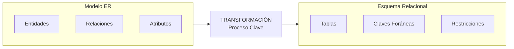
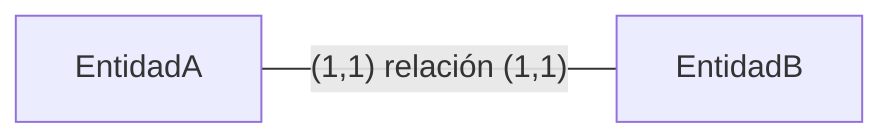
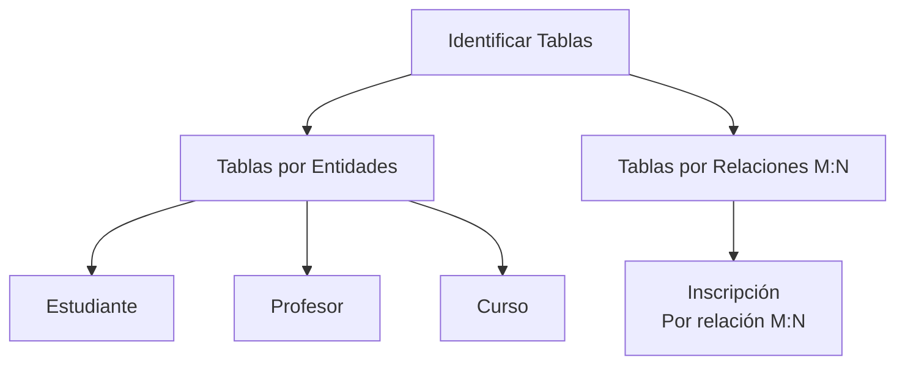
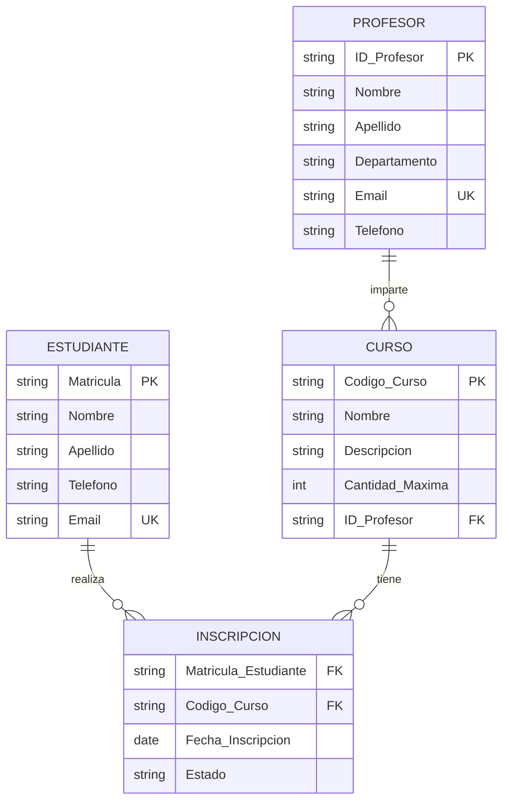

# 🗃️ **Clase 2: Transformación de Diagramas ER a Esquemas Relacionales**

<div align="center">
  
  
  
  <h1>🔄 Del Modelo Conceptual a la Estructura Lógica</h1>
  
  <p><em>Conectando ideas abstractas con estructuras implementables</em></p>
</div>

---

## 🎯 **Objetivos de Esta Clase**

### **Al finalizar esta sesión, serás capaz de:**

✅ Entender el **proceso de transformación** de modelos ER a esquemas relacionales  
✅ Aplicar las **reglas de mapeo** para cada elemento del diagrama ER  
✅ Identificar qué tablas crear para diferentes tipos de relaciones  
✅ Diseñar **esquemas relacionales completos** a partir de diagramas ER  
✅ Prever **restricciones de integridad** durante el diseño

---

## 📊 **¿Por Qué Esta Transformación es CRÍTICA?**

### **El Puente entre Dos Mundos**



### **¿Qué Definimos en Esta Transformación?**

- 🔧 **La estructura** que tendrá tu base de datos
- ⚡ **El rendimiento** de las consultas futuras
- 🛡️ **La integridad** de tus datos
- 📈 **La escalabilidad** del sistema completo
- 🔄 **La mantenibilidad** a largo plazo

> **💡 Dato profesional**: En proyectos reales, el 70% del tiempo de diseño de bases de datos se invierte en esta etapa. Un error aquí puede costar miles de horas de corrección posterior.

---

## 🔄 **Reglas de Transformación (Sin SQL)**

### **📋 Reglas Básicas de Mapeo**

| Elemento en Diagrama ER | Se Transforma a en Esquema Relacional       | Notación Conceptual                       |
| ----------------------- | ------------------------------------------- | ----------------------------------------- |
| **Entidad Fuerte**      | → **Tabla/Relación**                        | `[Estudiante]` → Tabla `Estudiante`       |
| **Atributo Simple**     | → **Columna en la tabla**                   | `Nombre` → Columna `Nombre`               |
| **Atributo Clave (PK)** | → **Clave Primaria de la tabla**            | `Matrícula(PK)` → PK `(Matrícula)`        |
| **Atributo Multivalor** | → **Nueva tabla relacionada**               | `Teléfonos` → Tabla `Teléfono_Estudiante` |
| **Entidad Débil**       | → **Tabla con referencia a entidad fuerte** | `Dependiente` → FK a `Empleado`           |

### **🎯 Transformación de Relaciones**

#### **Caso 1: Relación 1:1 (Uno a Uno)**

DIAGRAMA ER:



OPCIONES DE TRANSFORMACIÓN:

- Opción A: Clave foránea en EntidadA con restricción UNIQUE
- Opción B: Clave foránea en EntidadB con restricción UNIQUE
- Opción C: Tabla intermedia (cuando la relación tiene atributos)

EJEMPLO CONCRETO:


Transformación:
En tabla Estudiante, agregar ID_Correo con UNIQUE

#### **Caso 2: Relación 1:N (Uno a Muchos)**

```
DIAGRAMA ER:
[Entidad1] ┼───< (0,N) relación (1,1) ─── [EntidadN]

REGLA DE TRANSFORMACIÓN:
• La clave foránea va en la tabla del lado "N" (muchos)

EJEMPLO CONCRETO:
[Profesor] ┼───< imparte (1,1) ─── [Curso]
Transformación: En tabla Curso, agregar ID_Profesor como FK
```

#### **Caso 3: Relación M:N (Muchos a Muchos)**

```
DIAGRAMA ER:
[EntidadA] >───< [EntidadB]

REGLA DE TRANSFORMACIÓN:
• Crear NUEVA tabla intermedia

COMPONENTES DE LA NUEVA TABLA:
1. Claves foráneas a ambas entidades
2. Clave primaria compuesta (ambas FKs) o un ID adicional
3. Atributos propios de la relación (si existen)

EJEMPLO CONCRETO:
[Estudiante] >───< [Curso]
Transformación: Nueva tabla "Inscripción" con:
                - Matrícula_Estudiante (FK a Estudiante)
                - Código_Curso (FK a Curso)
                - Fecha_Inscripción (atributo de la relación)
```

#### **Caso 4: Relaciones con Atributos Propios**

```
REGLA GENERAL:
• Los atributos de la relación van en:
  - Tabla del lado "N" en relaciones 1:N
  - Tabla intermedia en relaciones M:N

EJEMPLO:
Relación "trabaja_en" entre Empleado y Proyecto (M:N)
Atributo: Horas_Semanales
Solución: Va en tabla intermedia "Asignación"
```

---

## 🛠️ **Proceso Metodológico en 5 Pasos**

### **Paso 1: Análisis del Diagrama ER**

**Identificar todos los componentes:**

```
ENTIDADES PRINCIPALES:
• Estudiante
• Profesor
• Curso

RELACIONES:
1. Profesor ┼───< Curso (1:N, "imparte")
2. Estudiante >───< Curso (M:N, "inscribe")

ATRIBUTOS CLAVE:
• Estudiante: Matrícula (PK), Nombre, Apellido
• Profesor: ID_Profesor (PK), Nombre, Departamento
• Curso: Código (PK), Nombre, Descripción
```

### **Paso 2: Lista de Tablas Necesarias**



### **Paso 3: Jerarquía de Creación**

```
ORDEN RECOMENDADO:
1. Tablas sin dependencias (sin FKs)
   → Profesor (independiente)

2. Tablas que dependen de #1
   → Curso (necesita FK a Profesor)

3. Otras tablas independientes
   → Estudiante (independiente)

4. Tablas de relaciones M:N
   → Inscripción (necesita FKs a Estudiante y Curso)
```

### **Paso 4: Diseño Detallado por Tabla**

#### **Tabla Profesor (Entidad fuerte)**

```
COLUMNAS:
• ID_Profesor (PK) - Identificador único
• Nombre - Nombre del profesor
• Apellido - Apellido del profesor
• Departamento - Área de especialización
• Email - Correo electrónico
• Teléfono - Número de contacto

RESTRICCIONES:
• PK: ID_Profesor
• UNIQUE: Email (no debe repetirse)
• NOT NULL: Nombre, Apellido, Departamento
```

#### **Tabla Curso (Con FK - Relación 1:N)**

```
COLUMNAS:
• Código_Curso (PK) - Identificador del curso
• Nombre - Nombre del curso
• Descripción - Detalles del contenido
• Cantidad_Máxima - Cupo máximo
• ID_Profesor (FK) - ← ¡AQUÍ ESTÁ LA RELACIÓN 1:N!

RESTRICCIONES:
• PK: Código_Curso
• FK: ID_Profesor referencia a Profesor(ID_Profesor)
• CHECK: Cantidad_Máxima > 0
```

#### **Tabla Estudiante (Entidad fuerte)**

```
COLUMNAS:
• Matrícula (PK) - Identificador único
• Nombre - Nombre del estudiante
• Apellido - Apellido del estudiante
• Teléfono - Número de contacto
• Email - Correo electrónico

RESTRICCIONES:
• PK: Matrícula
• UNIQUE: Email
• NOT NULL: Nombre, Apellido
```

#### **Tabla Inscripción (Relación M:N)**

```
COLUMNAS:
• Matrícula_Estudiante (FK) - Referencia a Estudiante
• Código_Curso (FK) - Referencia a Curso
• Fecha_Inscripción - ← Atributo de la relación
• Estado - ← Atributo de la relación

RESTRICCIONES:
• PK: (Matrícula_Estudiante, Código_Curso)
• FK1: Matrícula_Estudiante referencia a Estudiante(Matrícula)
• FK2: Código_Curso referencia a Curso(Código_Curso)
• CHECK: Estado en ['Activa', 'Completada', 'Cancelada']
```

### **Paso 5: Restricciones de Integridad**

#### **Tipos de Restricciones a Considerar:**

```
1. CLAVES PRIMARIAS (PK):
   • Aseguran unicidad de cada registro
   • No pueden ser NULL

2. CLAVES FORÁNEAS (FK):
   • Mantienen relaciones entre tablas
   • Referencian PKs existentes

3. UNICIDAD (UNIQUE):
   • Valores que no deben repetirse
   • Ejemplo: Email, Número de documento

4. DOMINIO (CHECK):
   • Valores permitidos para una columna
   • Ejemplo: Edad > 0, Estado válido

5. OBLIGATORIEDAD (NOT NULL):
   • Campos que deben tener valor
   • Ejemplo: Nombre, Fecha_Nacimiento
```

#### **Aplicación a Nuestro Caso:**

```
PARA TABLA CURSO:
• Código_Curso: PK, NOT NULL
• ID_Profesor: FK, NOT NULL (todo curso tiene profesor)
• Cantidad_Máxima: CHECK (valor entre 10 y 100)

PARA TABLA INSCRIPCIÓN:
• Matrícula_Estudiante: FK, NOT NULL
• Código_Curso: FK, NOT NULL
• Estado: CHECK (valores permitidos)
• UNIQUE: (Matrícula_Estudiante, Código_Curso) para evitar duplicados
```

---

## 📊 **Visualización del Esquema Resultante**

### **Diagrama del Esquema Relacional**



### **Estructura Jerárquica**

```
SISTEMA DE INSCRIPCIÓN
├── PROFESOR (independiente)
│   ├── ID_Profesor (PK)
│   ├── Nombre
│   ├── Apellido
│   ├── Departamento
│   ├── Email (UNIQUE)
│   └── Teléfono
│
├── CURSO (depende de PROFESOR)
│   ├── Código_Curso (PK)
│   ├── Nombre
│   ├── Descripción
│   ├── Cantidad_Máxima
│   └── ID_Profesor (FK → PROFESOR)
│
├── ESTUDIANTE (independiente)
│   ├── Matrícula (PK)
│   ├── Nombre
│   ├── Apellido
│   ├── Teléfono
│   └── Email (UNIQUE)
│
└── INSCRIPCIÓN (relación M:N)
    ├── Matrícula_Estudiante (FK → ESTUDIANTE)
    ├── Código_Curso (FK → CURSO)
    ├── Fecha_Inscripción
    └── Estado

    CLAVE PRIMARIA: (Matrícula_Estudiante, Código_Curso)
```

---

## 💡 **Buenas Prácticas y Consideraciones**

### **Convenciones de Nombrado**

```
PARA TABLAS:
• Usar singular (Estudiante, no Estudiantes)
• Ser descriptivo pero conciso
• Mantener consistencia en todo el esquema

PARA COLUMNAS:
• Usar snake_case para múltiples palabras (fecha_inscripcion)
• Evitar abreviaturas oscuras
• Ser claro en el propósito

PARA CLAVES FORÁNEAS:
• Indicar claramente la tabla referenciada
• Ejemplos buenos: ID_Profesor, Codigo_Curso
• Ejemplos a evitar: Profesor, Curso (ambiguos)
```

### **Decisiones de Diseño Clave**

```
1. CLAVES PRIMARIAS:
   • Naturales: Usar identificadores del dominio (Matrícula)
   • Artificiales: Crear IDs numéricos (ID_Estudiante)
   • Consideración: Las naturales son más comprensibles

2. MANEJO DE RELACIONES:
   • 1:1: Evaluar si realmente es 1:1 o puede evolucionar
   • 1:N: Siempre FK en el lado "N"
   • M:N: Siempre tabla intermedia

3. ATRIBUTOS DE RELACIÓN:
   • No olvidarlos durante la transformación
   • Ubicarlos correctamente según tipo de relación
```

### **Checklist de Validación**

```
ANTES DE DAR POR TERMINADA LA TRANSFORMACIÓN:
✓ ¿Todas las entidades tienen tabla correspondiente?
✓ ¿Todas las relaciones están correctamente representadas?
✓ ¿Las cardinalidades se respetan en el diseño?
✓ ¿Atributos multivalor tienen su propia tabla?
✓ ¿Claves foráneas referencian PKs existentes?
✓ ¿El diseño soporta los requisitos de consulta?
✓ ¿Hay redundancia de datos innecesaria?
✓ ¿Las convenciones de nombrado son consistentes?
```

---

## 🎯 **Ejercicio 1: Sistema de Biblioteca (Transformación)**

### **📋 Recordando los Requerimientos:**

1. **Libros** tienen ISBN, título, autor, año de publicación
2. **Miembros** tienen ID, nombre, email, fecha de inscripción
3. Un **miembro** puede pedir prestados muchos **libros**
4. Un **libro** puede ser prestado a muchos **miembros** (en diferentes momentos)
5. Cada **préstamo** registra fecha de préstamo, fecha de devolución y estado

### **🎯 Tu Tarea de Transformación:**

**Parte A: Identificación de Componentes**

1. Lista las entidades principales
2. Identifica el tipo de relación entre Miembro y Libro
3. Determina qué atributos pertenecen a la relación

**Parte B: Diseño del Esquema**

1. Crea la lista de tablas necesarias
2. Define la estructura de cada tabla (columnas)
3. Especifica las restricciones de integridad (PK, FK, etc.)
4. Dibuja el esquema relacional resultante

### **📝 Formato de Entrega:**

```
EJERCICIO 1 - BIBLIOTECA
├── Análisis de Componentes
│   ├── Entidades identificadas: ______
│   ├── Tipo de relación: ______
│   └── Atributos de relación: ______
│
├── Lista de Tablas
│   ├── 1. ______
│   ├── 2. ______
│   └── 3. ______
│
└── Estructura por Tabla
    ├── Tabla 1: [columnas y restricciones]
    ├── Tabla 2: [columnas y restricciones]
    └── Tabla 3: [columnas y restricciones]
```

---

## 🆕 **Ejercicio 2: Sistema de Gestión de Proyectos (Nuevo)**

### **🏢 Contexto del Sistema:**

Una empresa necesita gestionar sus proyectos, empleados y asignaciones.

### **📋 Requerimientos Detallados:**

1. **Empleados** tienen: ID_Empleado, Nombre, Apellido, Puesto, Fecha_Contratación
2. **Proyectos** tienen: Código_Proyecto, Nombre, Presupuesto, Fecha_Inicio, Fecha_Fin
3. **Departamentos** tienen: Código_Depto, Nombre, Ubicación
4. Un **empleado** puede trabajar en varios **proyectos**
5. Un **proyecto** tiene varios **empleados** asignados
6. Se necesita registrar las **horas trabajadas** por cada empleado en cada proyecto
7. Cada proyecto tiene un **gerente** (que es también un empleado)
8. Cada empleado pertenece a un **departamento**

### **🔍 Análisis de Relaciones:**

```
Relaciones a considerar:
1. Empleado ──< trabaja_en >── Proyecto (¿qué tipo de relación?)
2. Empleado ──< gerencia ─── Proyecto (¿qué tipo de relación?)
3. Departamento ──< tiene ─── Empleado (¿qué tipo de relación?)
```

### **🎯 Tu Tarea Completa:**

#### **Parte A: Diagrama ER (en draw.io)**

1. Crea el diagrama ER con todas las entidades
2. Incluye todos los atributos mencionados
3. Establece relaciones con cardinalidades correctas
4. Identifica atributos que pertenecen a relaciones

#### **Parte B: Transformación a Esquema Relacional**

1. Aplica las reglas de transformación aprendidas
2. Crea la lista completa de tablas necesarias
3. Define estructura detallada para cada tabla
4. Especifica todas las restricciones de integridad

#### **Parte C: Preguntas de Análisis**

1. ¿Cómo manejarías que un gerente también es empleado?
2. ¿Qué tabla necesitas para registrar las horas trabajadas?
3. ¿Cómo evitarías que un empleado trabaje horas negativas?
4. ¿Qué restricción pondrías para fechas de proyecto?

### **📁 Estructura de Entrega Esperada:**

```
📦 EJERCICIO_2_PROYECTOS/
├── 📄 analisis_relaciones.md
├── 📄 lista_tablas.md
├── 📄 estructuras_tablas.md
└── 📄 preguntas_respuestas.md
```

---

## 🚨 **Errores Comunes y Cómo Evitarlos**

### **Error 1: Confundir 1:N con M:N**

```
✗ INCORRECTO: Para relación 1:N, poner FKs en ambas tablas
✓ CORRECTO: FK solo en el lado "N" de la relación

EJEMPLO Profesor(1) ──< Curso(N):
✗ Curso tiene FK a Profesor Y Profesor tiene FK a Curso
✓ Solo Curso tiene FK a Profesor
```

### **Error 2: Olvidar tabla intermedia en M:N**

```
✗ INCORRECTO: Intentar representar M:N con FKs directas
✓ CORRECTO: Crear tabla intermedia con FKs a ambas entidades

EJEMPLO Estudiante(M) ──< Inscripción >── Curso(N):
✗ Estudiante tiene FK a Curso Y Curso tiene FK a Estudiante
✓ Tabla Inscripción con FKs a Estudiante y Curso
```

### **Error 3: Atributos de relación en lugar equivocado**

```
✗ INCORRECTO: Poner atributos de relación en entidades
✓ CORRECTO: Atributos de relación van en:
   • Tabla del lado "N" en 1:N
   • Tabla intermedia en M:N

EJEMPLO: Fecha_Inscripción pertenece a la relación, no a Estudiante
```

### **Error 4: Malinterpretar cardinalidades**

```
✗ (0,N) ── (1,1) NO ES LO MISMO que (1,N) ── (0,1)
✓ Leer siempre: (mínimo,máximo) ── (mínimo,máximo)

EJEMPLO: (0,N) ── (1,1) significa:
• Lado izquierdo: puede tener 0 o muchos
• Lado derecho: debe tener exactamente 1
```

---

## 📚 **Resumen de lo Aprendido**

### **✅ Reglas de Transformación Dominadas:**

1. **Entidad** → Tabla
2. **Atributo** → Columna
3. **PK en ER** → PK en tabla
4. **Relación 1:1** → FK con UNIQUE o tabla intermedia
5. **Relación 1:N** → FK en tabla del lado "N"
6. **Relación M:N** → Nueva tabla intermedia
7. **Atributos de relación** → En tabla correspondiente

### **✅ Proceso Metodológico:**

1. **Analizar** el diagrama ER
2. **Listar** tablas necesarias
3. **Establecer** jerarquía de creación
4. **Diseñar** estructura de cada tabla
5. **Definir** restricciones de integridad

### **✅ Buenas Prácticas:**

- Convenciones de nombrado consistentes
- Considerar restricciones desde el diseño
- Validar contra requisitos de consulta
- Documentar decisiones de diseño

---

## 🏆 **Preparación para la Próxima Clase**

### **Lo que viene:**

En la siguiente clase, tomaremos estos **esquemas relacionales** y aprenderemos a implementarlos usando **SQL**, creando las tablas físicas en un sistema de gestión de bases de datos.

### **Tarea para la próxima sesión:**

1. Completar los dos ejercicios propuestos
2. Traer preguntas sobre el proceso de transformación
3. Pensar en un mini-proyecto personal para practicar

### **Material de estudio recomendado:**

- Revisar los diagramas ER creados en la clase anterior
- Practicar con diferentes tipos de relaciones
- Intentar transformar diagramas de ejemplos reales

---

<div align="center">
<h3>🎯 ¿Listo para el Desafío?</h3>

**"La transformación de ER a Relacional es donde la teoría se encuentra con la práctica. Cada decisión de diseño tiene consecuencias reales en el sistema final."**

¡Completa los ejercicios y prepárate para la implementación!

</div>

---

<div align="right">
<sub><em>Clase 2: Transformación ER → Relacional | Solo conceptos, sin SQL</em></sub>
</div>
