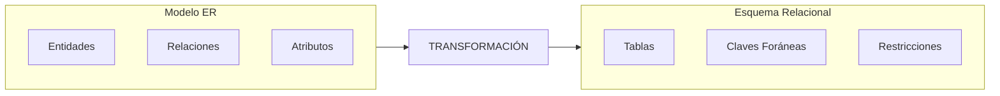
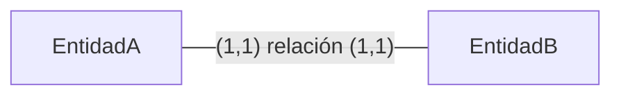
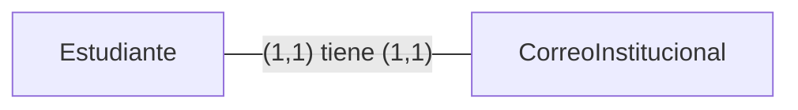
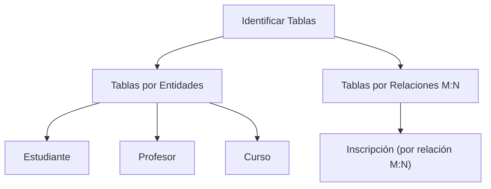
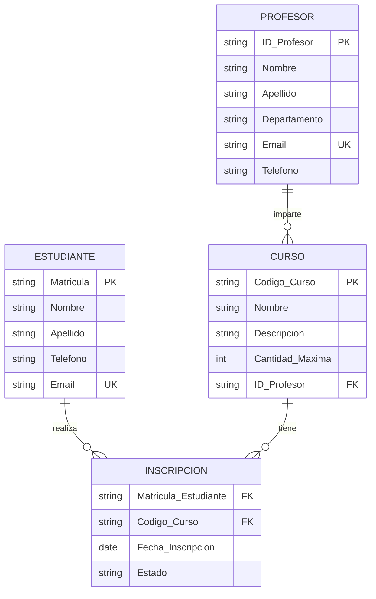

# Clase 2: Transformación de Diagramas ER a Esquemas Relacionales

<div align="center">
  
  

  <h2>Del modelo conceptual a la estructura lógica</h2>

  <p><em>Conectando ideas abstractas con estructuras que se pueden implementar</em></p>
</div>

---

## Objetivos de esta clase

Al finalizar esta sesión, serás capaz de:

- Entender el **proceso de transformación** de modelos ER a esquemas relacionales
- Aplicar las **reglas de mapeo** para cada elemento del diagrama ER
- Identificar qué tablas crear para diferentes tipos de relaciones
- Diseñar **esquemas relacionales completos** a partir de diagramas ER
- Prever **restricciones de integridad** durante el diseño

---

## ¿Por qué esta transformación es importante?

### El puente entre dos mundos

En la clase anterior creamos diagramas ER que representan el mundo real de forma visual. Ahora necesitamos convertir esos diagramas en algo que una computadora pueda entender: **tablas con columnas, claves y restricciones**.


```mermaid
flowchart LR
    subgraph A [Modelo ER]
        D[Entidades]
        E[Relaciones]
        F[Atributos]
    end

    A --> B[TRANSFORMACIÓN]

    subgraph C [Esquema Relacional]
        G[Tablas]
        H[Claves Foráneas]
        I[Restricciones]
    end

    B --> C
```

### ¿Qué definimos en esta transformación?

- **La estructura** que tendrá tu base de datos
- **El rendimiento** de las consultas futuras
- **La integridad** de tus datos
- **La escalabilidad** del sistema completo
- **La mantenibilidad** a largo plazo

> **Dato profesional**: En proyectos reales, el 70% del tiempo de diseño de bases de datos se invierte en esta etapa. Un error aquí puede costar muchas horas de corrección después.

---

## Reglas de transformación (sin SQL)

En esta clase trabajamos solo con conceptos. Todavía no escribiremos código SQL; eso lo haremos en la clase 3.

### Reglas básicas de mapeo

| Elemento en el diagrama ER | Se transforma en...                         | Ejemplo                                   |
| -------------------------- | ------------------------------------------- | ----------------------------------------- |
| **Entidad Fuerte**         | Tabla                                       | `[Estudiante]` se convierte en tabla `Estudiante`       |
| **Atributo Simple**        | Columna en la tabla                         | `Nombre` se convierte en columna `Nombre`               |
| **Atributo Clave (PK)**    | Clave primaria de la tabla                  | `Matrícula(PK)` se convierte en PK `(Matrícula)`        |
| **Atributo Multivalor**    | Nueva tabla aparte, relacionada             | `Teléfonos` se convierte en tabla `Teléfono_Estudiante` |
| **Entidad Débil**          | Tabla con referencia (FK) a entidad fuerte  | `Dependiente` tiene FK hacia `Empleado`                 |

**Explicación sencilla:** Cada "caja" del diagrama ER se convierte en una tabla. Cada "óvalo" (atributo) se convierte en una columna de esa tabla. Y las líneas de conexión se convierten en claves foráneas.

### Transformación de relaciones

#### Caso 1: Relación 1:1 (Uno a Uno)


```mermaid
flowchart LR
    A[EntidadA] -- "(1,1) relación (1,1)" --- B[EntidadB]
```

**¿Qué hacer?** Tienes tres opciones:

- **Opción A:** Agregar la clave foránea en la tabla de EntidadA con restricción UNIQUE
- **Opción B:** Agregar la clave foránea en la tabla de EntidadB con restricción UNIQUE
- **Opción C:** Crear una tabla intermedia (cuando la relación tiene atributos propios)

**Ejemplo concreto:**


```mermaid
flowchart LR
    E[Estudiante] -- "(1,1) tiene (1,1)" --- C[CorreoInstitucional]
```

Transformación: En la tabla Estudiante, agregar una columna `ID_Correo` con restricción UNIQUE.

**¿Por qué UNIQUE?** Porque en una relación 1:1, cada estudiante solo puede tener un correo, y cada correo solo pertenece a un estudiante. UNIQUE garantiza que no se repita.

---

#### Caso 2: Relación 1:N (Uno a Muchos)

```
DIAGRAMA ER:
[Entidad1] ┼───< (0,N) relación (1,1) ─── [EntidadN]

REGLA: La clave foránea siempre va en la tabla del lado "N" (muchos).

EJEMPLO:
[Profesor] ┼───< imparte (1,1) ─── [Curso]
Transformación: En la tabla Curso, agregar columna ID_Profesor como FK.
```

**Explicación sencilla:** Si un profesor imparte muchos cursos, no puedes poner todos los códigos de curso dentro de la tabla Profesor (habría una cantidad variable). En cambio, en cada curso guardas **quién es su profesor**. Así, el lado que tiene "muchos" es el que lleva la referencia.

---

#### Caso 3: Relación M:N (Muchos a Muchos)

```
DIAGRAMA ER:
[EntidadA] >───< [EntidadB]

REGLA: Crear una NUEVA tabla intermedia.

COMPONENTES DE LA NUEVA TABLA:
1. Claves foráneas a ambas entidades
2. Clave primaria compuesta (ambas FKs) o un ID propio
3. Atributos propios de la relación (si existen)

EJEMPLO:
[Estudiante] >───< [Curso]
Transformación: Nueva tabla "Inscripción" con:
                - Matrícula_Estudiante (FK a Estudiante)
                - Código_Curso (FK a Curso)
                - Fecha_Inscripción (atributo de la relación)
```

**Explicación sencilla:** Si un estudiante puede estar en muchos cursos, y un curso puede tener muchos estudiantes, no puedes poner esa información en ninguna de las dos tablas. Necesitas una **tabla nueva en medio** que registre "quién se inscribió en qué".

---

#### Caso 4: Relaciones con atributos propios

```
REGLA GENERAL:
Los atributos que pertenecen a la relación (no a las entidades) van en:
  - La tabla del lado "N" en relaciones 1:N
  - La tabla intermedia en relaciones M:N

EJEMPLO:
Relación "trabaja_en" entre Empleado y Proyecto (M:N)
Atributo: Horas_Semanales
Solución: Horas_Semanales va en la tabla intermedia "Asignación"
```

**Explicación sencilla:** `Horas_Semanales` no le pertenece al empleado ni al proyecto, sino a la relación entre ambos. Un empleado puede trabajar 10 horas en un proyecto y 20 en otro.

---

## Proceso metodológico en 5 pasos

### Paso 1: Análisis del diagrama ER

Antes de transformar, identifica todos los componentes de tu diagrama:

```
ENTIDADES PRINCIPALES:
- Estudiante
- Profesor
- Curso

RELACIONES:
1. Profesor ┼───< Curso (1:N, "imparte")
2. Estudiante >───< Curso (M:N, "inscribe")

ATRIBUTOS CLAVE:
- Estudiante: Matrícula (PK), Nombre, Apellido
- Profesor: ID_Profesor (PK), Nombre, Departamento
- Curso: Código (PK), Nombre, Descripción
```

### Paso 2: Lista de tablas necesarias

Haz una lista de todas las tablas que vas a necesitar:


```mermaid
flowchart TD
    A[Identificar Tablas] --> B[Tablas por Entidades]
    A --> C[Tablas por Relaciones M:N]

    B --> D[Estudiante]
    B --> E[Profesor]
    B --> F[Curso]

    C --> G["Inscripción (por relación M:N)"]
```

**Regla fácil:** Una tabla por cada entidad + una tabla extra por cada relación M:N.

### Paso 3: Jerarquía de creación

Define en qué orden crear las tablas. Las tablas que no dependen de otras se crean primero:

```
ORDEN RECOMENDADO:
1. Tablas sin dependencias (sin FKs)
   → Profesor (independiente)

2. Tablas que dependen de las anteriores
   → Curso (necesita FK a Profesor)

3. Otras tablas independientes
   → Estudiante (independiente)

4. Tablas de relaciones M:N (al final)
   → Inscripción (necesita FKs a Estudiante y Curso)
```

**Explicación sencilla:** Es como construir una casa: primero los cimientos, luego las paredes, al final el techo. No puedes hacer referencia a una tabla que todavía no existe.

### Paso 4: Diseño detallado por tabla

Para cada tabla, define sus columnas y restricciones:

#### Tabla Profesor (Entidad fuerte)

```
COLUMNAS:
- ID_Profesor (PK) - Identificador único
- Nombre - Nombre del profesor
- Apellido - Apellido del profesor
- Departamento - Área de especialización
- Email - Correo electrónico
- Teléfono - Número de contacto

RESTRICCIONES:
- PK: ID_Profesor
- UNIQUE: Email (no debe repetirse)
- NOT NULL: Nombre, Apellido, Departamento
```

#### Tabla Curso (Con FK - Relación 1:N)

```
COLUMNAS:
- Código_Curso (PK) - Identificador del curso
- Nombre - Nombre del curso
- Descripción - Detalles del contenido
- Cantidad_Máxima - Cupo máximo
- ID_Profesor (FK) - Aquí va la relación 1:N

RESTRICCIONES:
- PK: Código_Curso
- FK: ID_Profesor referencia a Profesor(ID_Profesor)
- CHECK: Cantidad_Máxima > 0
```

#### Tabla Estudiante (Entidad fuerte)

```
COLUMNAS:
- Matrícula (PK) - Identificador único
- Nombre - Nombre del estudiante
- Apellido - Apellido del estudiante
- Teléfono - Número de contacto
- Email - Correo electrónico

RESTRICCIONES:
- PK: Matrícula
- UNIQUE: Email
- NOT NULL: Nombre, Apellido
```

#### Tabla Inscripción (Relación M:N)

```
COLUMNAS:
- Matrícula_Estudiante (FK) - Referencia a Estudiante
- Código_Curso (FK) - Referencia a Curso
- Fecha_Inscripción - Atributo de la relación
- Estado - Atributo de la relación

RESTRICCIONES:
- PK: (Matrícula_Estudiante, Código_Curso)
- FK1: Matrícula_Estudiante referencia a Estudiante(Matrícula)
- FK2: Código_Curso referencia a Curso(Código_Curso)
- CHECK: Estado en ['Activa', 'Completada', 'Cancelada']
```

### Paso 5: Restricciones de integridad

Las restricciones son **reglas que protegen tus datos** para que siempre sean válidos.

#### Tipos de restricciones

| Tipo              | ¿Qué hace?                              | Ejemplo                              |
| ----------------- | ---------------------------------------- | ------------------------------------ |
| **PRIMARY KEY**   | Identifica cada fila de forma única      | `ID_Profesor` no se puede repetir    |
| **FOREIGN KEY**   | Mantiene relaciones válidas entre tablas | `ID_Profesor` en Curso debe existir en Profesor |
| **UNIQUE**        | Impide valores repetidos                 | `Email` no se puede repetir          |
| **CHECK**         | Valida que los valores cumplan una regla | `Edad > 0`, `Estado` sea válido      |
| **NOT NULL**      | Obliga a que el campo tenga valor        | `Nombre` no puede estar vacío        |

---

## Visualización del esquema resultante

### Diagrama del esquema relacional


```mermaid
erDiagram
    PROFESOR {
        string ID_Profesor PK
        string Nombre
        string Apellido
        string Departamento
        string Email UK
        string Telefono
    }

    CURSO {
        string Codigo_Curso PK
        string Nombre
        string Descripcion
        int Cantidad_Maxima
        string ID_Profesor FK
    }

    ESTUDIANTE {
        string Matricula PK
        string Nombre
        string Apellido
        string Telefono
        string Email UK
    }

    INSCRIPCION {
        string Matricula_Estudiante FK
        string Codigo_Curso FK
        date Fecha_Inscripcion
        string Estado
    }

    PROFESOR ||--o{ CURSO : "imparte"
    ESTUDIANTE ||--o{ INSCRIPCION : "realiza"
    CURSO ||--o{ INSCRIPCION : "tiene"
```

### Estructura jerárquica

```
SISTEMA DE INSCRIPCIÓN
├── PROFESOR (independiente)
│   ├── ID_Profesor (PK)
│   ├── Nombre
│   ├── Apellido
│   ├── Departamento
│   ├── Email (UNIQUE)
│   └── Teléfono
│
├── CURSO (depende de PROFESOR)
│   ├── Código_Curso (PK)
│   ├── Nombre
│   ├── Descripción
│   ├── Cantidad_Máxima
│   └── ID_Profesor (FK → PROFESOR)
│
├── ESTUDIANTE (independiente)
│   ├── Matrícula (PK)
│   ├── Nombre
│   ├── Apellido
│   ├── Teléfono
│   └── Email (UNIQUE)
│
└── INSCRIPCIÓN (relación M:N)
    ├── Matrícula_Estudiante (FK → ESTUDIANTE)
    ├── Código_Curso (FK → CURSO)
    ├── Fecha_Inscripción
    └── Estado

    CLAVE PRIMARIA: (Matrícula_Estudiante, Código_Curso)
```

---

## Buenas prácticas y consideraciones

### Convenciones de nombres

| ¿Qué nombrar?         | Buena práctica                                | Ejemplo bueno      | Ejemplo malo      |
| ---------------------- | --------------------------------------------- | ------------------- | ----------------- |
| **Tablas**             | Singular, descriptivo, consistente            | `Estudiante`        | `Estudiantes`, `est` |
| **Columnas**           | snake_case, claro en propósito                | `fecha_inscripcion` | `fi`, `dato1`     |
| **Claves foráneas**    | Indicar claramente la tabla referenciada      | `ID_Profesor`       | `Profesor`        |

### Decisiones de diseño clave

```
1. CLAVES PRIMARIAS:
   - Naturales: Usar identificadores del dominio (Matrícula)
   - Artificiales: Crear IDs numéricos (ID_Estudiante)
   - Tip: Las naturales son más comprensibles, las artificiales son más simples

2. MANEJO DE RELACIONES:
   - 1:1: Evaluar si realmente es 1:1 o puede cambiar en el futuro
   - 1:N: Siempre FK en el lado "N"
   - M:N: Siempre tabla intermedia

3. ATRIBUTOS DE RELACIÓN:
   - No olvidarlos durante la transformación
   - Ubicarlos correctamente según tipo de relación
```

### Checklist de validación

Antes de dar por terminada tu transformación, verifica lo siguiente:

- ¿Todas las entidades tienen su tabla correspondiente?
- ¿Todas las relaciones están correctamente representadas?
- ¿Las cardinalidades se respetan en el diseño?
- ¿Los atributos multivalor tienen su propia tabla?
- ¿Las claves foráneas referencian PKs existentes?
- ¿El diseño soporta los datos que necesitas consultar?
- ¿Hay redundancia de datos innecesaria?
- ¿Los nombres son consistentes en todo el esquema?

---

## Ejercicio 1: Sistema de Biblioteca (Transformación)

### Recordando los requerimientos

1. **Libros** tienen ISBN, título, autor, año de publicación
2. **Miembros** tienen ID, nombre, email, fecha de inscripción
3. Un **miembro** puede pedir prestados muchos **libros**
4. Un **libro** puede ser prestado a muchos **miembros** (en diferentes momentos)
5. Cada **préstamo** registra fecha de préstamo, fecha de devolución y estado

### Tu tarea de transformación

**Parte A: Identificación de componentes**

1. Lista las entidades principales
2. Identifica el tipo de relación entre Miembro y Libro
3. Determina qué atributos pertenecen a la relación

**Parte B: Diseño del esquema**

1. Crea la lista de tablas necesarias
2. Define la estructura de cada tabla (columnas)
3. Especifica las restricciones de integridad (PK, FK, etc.)
4. Dibuja el esquema relacional resultante

### Formato de entrega

```
EJERCICIO 1 - BIBLIOTECA
├── Análisis de Componentes
│   ├── Entidades identificadas: ______
│   ├── Tipo de relación: ______
│   └── Atributos de relación: ______
│
├── Lista de Tablas
│   ├── 1. ______
│   ├── 2. ______
│   └── 3. ______
│
└── Estructura por Tabla
    ├── Tabla 1: [columnas y restricciones]
    ├── Tabla 2: [columnas y restricciones]
    └── Tabla 3: [columnas y restricciones]
```

---

## Ejercicio 2: Sistema de Gestión de Proyectos

### Contexto del sistema

Una empresa necesita gestionar sus proyectos, empleados y asignaciones.

### Requerimientos detallados

1. **Empleados** tienen: ID_Empleado, Nombre, Apellido, Puesto, Fecha_Contratación
2. **Proyectos** tienen: Código_Proyecto, Nombre, Presupuesto, Fecha_Inicio, Fecha_Fin
3. **Departamentos** tienen: Código_Depto, Nombre, Ubicación
4. Un **empleado** puede trabajar en varios **proyectos**
5. Un **proyecto** tiene varios **empleados** asignados
6. Se necesita registrar las **horas trabajadas** por cada empleado en cada proyecto
7. Cada proyecto tiene un **gerente** (que es también un empleado)
8. Cada empleado pertenece a un **departamento**

### Análisis de relaciones

```
Relaciones a considerar:
1. Empleado ──< trabaja_en >── Proyecto (¿qué tipo de relación?)
2. Empleado ──< gerencia ─── Proyecto (¿qué tipo de relación?)
3. Departamento ──< tiene ─── Empleado (¿qué tipo de relación?)
```

### Tu tarea completa

#### Parte A: Diagrama ER (en draw.io)

1. Crea el diagrama ER con todas las entidades
2. Incluye todos los atributos mencionados
3. Establece relaciones con cardinalidades correctas
4. Identifica atributos que pertenecen a relaciones

#### Parte B: Transformación a esquema relacional

1. Aplica las reglas de transformación aprendidas
2. Crea la lista completa de tablas necesarias
3. Define estructura detallada para cada tabla
4. Especifica todas las restricciones de integridad

#### Parte C: Preguntas de análisis

1. ¿Cómo manejarías que un gerente también es empleado?
2. ¿Qué tabla necesitas para registrar las horas trabajadas?
3. ¿Cómo evitarías que un empleado trabaje horas negativas?
4. ¿Qué restricción pondrías para fechas de proyecto?

---

## Errores comunes y cómo evitarlos

### Error 1: Confundir 1:N con M:N

```
INCORRECTO: Para relación 1:N, poner FKs en ambas tablas
CORRECTO:   FK solo en el lado "N" de la relación

EJEMPLO Profesor(1) ──< Curso(N):
  Mal:  Curso tiene FK a Profesor Y Profesor tiene FK a Curso
  Bien: Solo Curso tiene FK a Profesor
```

### Error 2: Olvidar tabla intermedia en M:N

```
INCORRECTO: Intentar representar M:N con FKs directas
CORRECTO:   Crear tabla intermedia con FKs a ambas entidades

EJEMPLO Estudiante(M) ──< Inscripción >── Curso(N):
  Mal:  Estudiante tiene FK a Curso Y Curso tiene FK a Estudiante
  Bien: Tabla Inscripción con FKs a Estudiante y Curso
```

### Error 3: Atributos de relación en lugar equivocado

```
INCORRECTO: Poner atributos de relación en las entidades
CORRECTO:   Atributos de relación van en:
   - Tabla del lado "N" en 1:N
   - Tabla intermedia en M:N

EJEMPLO: Fecha_Inscripción pertenece a la relación, no a Estudiante
```

### Error 4: Malinterpretar cardinalidades

```
  (0,N) -- (1,1) NO ES LO MISMO que (1,N) -- (0,1)

  Siempre leer: (mínimo,máximo) -- (mínimo,máximo)

  EJEMPLO: (0,N) -- (1,1) significa:
  - Lado izquierdo: puede tener 0 o muchos
  - Lado derecho: debe tener exactamente 1
```

---

## Resumen de lo aprendido

### Reglas de transformación

1. **Entidad** se convierte en Tabla
2. **Atributo** se convierte en Columna
3. **PK en ER** se convierte en PK en tabla
4. **Relación 1:1** se convierte en FK con UNIQUE o tabla intermedia
5. **Relación 1:N** se convierte en FK en tabla del lado "N"
6. **Relación M:N** se convierte en nueva tabla intermedia
7. **Atributos de relación** van en la tabla correspondiente

### Proceso metodológico

1. **Analizar** el diagrama ER
2. **Listar** tablas necesarias
3. **Establecer** jerarquía de creación
4. **Diseñar** estructura de cada tabla
5. **Definir** restricciones de integridad

### Buenas prácticas

- Convenciones de nombres consistentes
- Considerar restricciones desde el diseño
- Validar contra requisitos de consulta
- Documentar decisiones de diseño

---

## Preparación para la próxima clase

### Lo que viene

En la siguiente clase, tomaremos estos **esquemas relacionales** y aprenderemos a implementarlos usando **SQL en SQL Server**, creando las tablas físicas en un sistema de gestión de bases de datos.

### Tarea para la próxima sesión

1. Completar los dos ejercicios propuestos
2. Traer preguntas sobre el proceso de transformación
3. Pensar en un mini-proyecto personal para practicar

### Material de estudio recomendado

- Revisar los diagramas ER creados en la clase anterior
- Practicar con diferentes tipos de relaciones
- Intentar transformar diagramas de ejemplos reales

---

<div align="center">

**"La transformación de ER a Relacional es donde la teoría se encuentra con la práctica. Cada decisión de diseño tiene consecuencias reales en el sistema final."**

Completa los ejercicios y prepárate para la implementación.

</div>

---

<div align="right">
<sub><em>Clase 2: Transformación ER a Relacional | Solo conceptos, sin SQL</em></sub>
</div>
