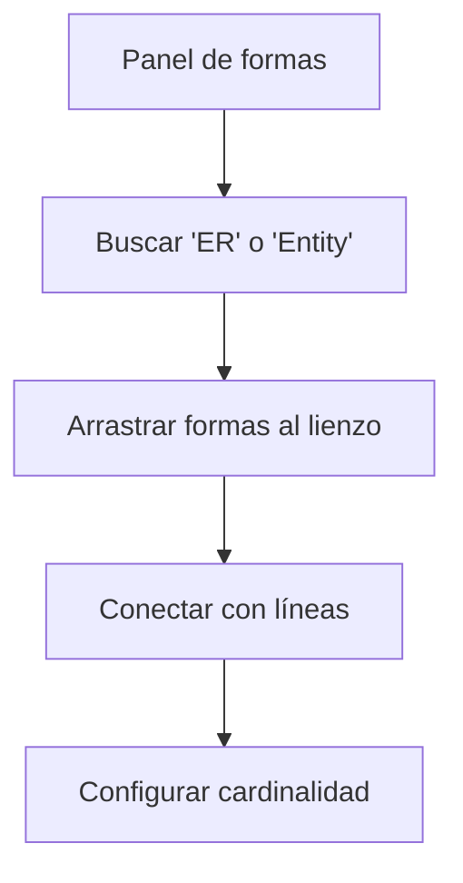
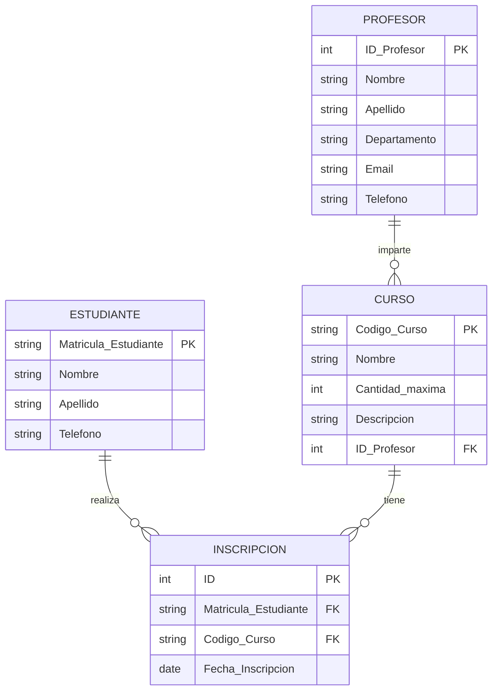

<div align="center">
  <h1>🗂️ Diseño de bases de datos mediante modelado entidad-relación</h1>

## 📊 **Diagramas Entidad-Relación con draw.io**


_Fundamentos del modelado conceptual de bases de datos_


</div>

---

## 🎯 **Objetivo del Módulo**

Al finalizar este módulo, serás capaz de:

- Comprender los conceptos fundamentales del modelo Entidad-Relación **"ER"**
- Identificar y modelar entidades, atributos y relaciones
- Representar correctamente la cardinalidad entre entidades
- Crear diagramas ER profesionales usando draw.io
- Convertir modelos conceptuales en esquemas relacionales

---

## 🧱 **Elementos Fundamentales del Modelo ER**

### 1. **🏛️ Entidades**

Representan "cosas" u "objetos" del mundo real sobre los cuales queremos almacenar la información.

| Elemento           | Descripción               | Ejemplo                    |
| ------------------ | ------------------------- | -------------------------- |
| **Entidad Fuerte** | Existe independientemente | `Estudiante`, `Producto`   |
| **Entidad Débil**  | Depende de otra entidad   | `Teléfono` (de `Empleado`) |

**🔧 En draw.io:** Busca "Entity" en la librería de formas o usa un rectángulo simple.

### 2. **🏷️ Atributos**

Características o propiedades de las entidades; en otras palabras, los atributos que tiene la entidad u objeto.

| Tipo de Atributo | Descripción           | Ejemplo en `Estudiante`         |
| ---------------- | --------------------- | ------------------------------- |
| **Simple**       | Atómico, no divisible | `Edad`                          |
| **Compuesto**    | Divisible en partes   | `Dirección` (calle, ciudad, CP) |
| **Derivado**     | Se calcula de otros   | `Edad` (de `FechaNacimiento`)   |
| **Clave**        | Identifica la entidad | `Id Matricula`                  |
| **Multivaluado** | Múltiples valores     | `Teléfonos`                     |

**🔧 En draw.io:** Usa elipses o círculos conectados a la entidad.

### 3. **🔗 Relaciones**

Asociaciones entre dos o más entidades.

| Tipo          | Símbolo | Descripción           | Ejemplo                         |
| ------------- | ------- | --------------------- | ------------------------------- |
| **Binaria**   | ────    | Entre dos entidades   | `Estudiante` - `Curso`          |
| **Recursiva** | ────◄─  | Entidad consigo misma | `Empleado` supervisa `Empleado` |
| **Ternaria**  | ──►◄─   | Entre tres entidades  | `Estudiante`-`Profesor`-`Curso` |

**🔧 En draw.io:** Usa líneas con rombos (opcional) para las relaciones.

---

## 📐 **Cardinalidad y Modalidad**

### **¿Cuántos? - Cardinalidad**

Define el número máximo de ocurrencias en una relación.

| Notación | Símbolo | Significado     |
| -------- | ------- | --------------- |
| **1:1**  | `┼───┼` | Uno a Uno       |
| **1:N**  | `┼───<` | Uno a Muchos    |
| **N:1**  | `>───┼` | Muchos a Uno    |
| **M:N**  | `>───<` | Muchos a Muchos |

### **¿Obligatorio? - Modalidad**

Define el mínimo de ocurrencias.

| Notación  | Símbolo | Significado            |
| --------- | ------- | ---------------------- |
| **(0,1)** | `○───`  | Opcional (mínimo 0)    |
| **(1,1)** | `───`   | Obligatorio (mínimo 1) |

**🎯 Ejemplo completo:** `(0,N)` significa: mínimo 0, máximo muchos.

## 🔄 **Convertir de Diagrama ER a Esquema Relacional**

_Nota: Se hablará con más detalle en la siguiente clase._

### **Reglas de transformación:**

1. **Entidad → Tabla**
2. **Atributo → Columna**
3. **Atributo clave → PRIMARY KEY**
4. **Relación 1:N → FOREIGN KEY en tabla "N"**
5. **Relación M:N → Nueva tabla intermedia**

---

## 🛠️ **Tutorial: Creando un Diagrama ER en draw.io**

### **Paso 1: Configuración inicial**

1. Accede a [app.diagrams.net](https://app.diagrams.net/) o descarga la aplicación
2. Selecciona "Crear nuevo diagrama"
3. Elige "Blank Diagram" o "Entity Relationship"

### **Paso 2: Usando las formas ER**



### **Paso 3: Librerías recomendadas**

1. **Formas básicas:** Para rectángulos (entidades)
2. **General:** Para elipses (atributos)
3. **Arrow:** Para relaciones y cardinalidades
4. **Entity Relationship:** (Si está disponible)

### **Paso 4: Mejores prácticas de diseño**

- ✅ **Alinea** los elementos usando las guías
- ✅ **Agrupa** entidades relacionadas
- ✅ **Usa colores** consistentes (ej: azul para entidades, verde para atributos)
- ✅ **Añade texto descriptivo** en las relaciones
- ✅ **Exporta** como PNG o PDF para compartir

---

## 📚 **Ejemplo Práctico: inscrpción de materias.**

### **Requerimientos:**

1. Un **estudiante** puede inscribirse en muchos **cursos**
2. Un **curso** tiene muchos **estudiantes**
3. Cada **curso** es impartido por un **profesor**
4. Un **profesor** puede impartir varios cursos
5. Cada **estudiante** tiene una **matrícula**
6. Cada **curso** tiene un **código único**

### **📝 Paso a paso en draw.io:**

**1. Crear las entidades:**

```
[Estudiante]    [Matricula]    [Curso]    [Profesor]
```

**2. Añadir atributos clave:**

- ESTUDIANTE

  - Matricula_Estudiante **(PK)**
  - Nombre
  - Apellido
  - Telefono

- PROFESOR

  - ID_Profesor **(PK)**
  - Nombre
  - Apellido
  - Departamento
  - Email
  - Telefono

- CURSO

  - Codigo_Curso **(PK)**
  - Nombre
  - Descripción
  - Cantidad_maxima
  - ID_Profesor **(FK)**

- INSCRIPCION (tabla intermedia para relación M:N)
  - ID **(PK)**
  - Matricula_Estudiante **(FK)**
  - Codigo_Curso **(FK)**
  - Fecha_Inscripcion

**3. Establecer relaciones:**

```
    Estudiante ───< Inscripción >─── Curso  (M:N)
        Un estudiante puede inscribirse en muchos cursos (0,N)
        Un curso puede tener muchos estudiantes inscritos (0,N)

    Profesor ───< Curso  (1:N)
        Un profesor puede impartir muchos cursos (0,N)
        Un curso es impartido por un solo profesor (1,1)
```

**4. Especificar cardinalidad:**

```
    Estudiante (0,N) ─── Inscripción ─── (0,N) Curso
    Profesor (1,1) ───< (0,N) Curso
```

### **🖼️ Diagrama Resultante:**



---

## 🧪 **Ejercicio Práctico**

### **Caso: Sistema de Biblioteca**

**Requerimientos:**

1. Los **libros** tienen ISBN, título y autor
2. Los **miembros** tienen ID, nombre y fecha de inscripción
3. Un **miembro** puede pedir prestados muchos **libros**
4. Un **libro** puede ser prestado a muchos **miembros** (en diferentes momentos)
5. Cada **préstamo** registra fecha de préstamo y devolución

### **📝 Tu tarea:**

1. Identifica las entidades y sus atributos
2. Determina las relaciones y cardinalidades
3. Crea el diagrama ER en draw.io

_Nota: puedes ayudarte de esta documentación: [Diagramas ER](https://www.processon.io/es/blog/er-diagram-tutorials)_

## 📖 **Recursos Adicionales**

### **Documentación oficial:**

- [Draw.io Tutorial - Entity Relationship](https://www.youtube.com/watch?v=fYGaXuclxas)
- [Simbología ER estándar](https://en.wikipedia.org/wiki/Entity–relationship_model)

### **Plantillas útiles en draw.io:**

1. File → New from Template → Software → Entity Relationship
2. Format panel → Style → Presets

### **Extensiones recomendadas:**

- **draw.io Integration** para VS Code
- **draw.io Diagrams** para Confluence

---

<div align="center">

_¡Has completado la clase de modelado ER! En el siguiente módulo aprenderás a optimizar tus diseños mediante las **formas normales** para eliminar redundancias y anomalías._

**💡 Recuerda:** Un buen diseño ER ahorra horas de desarrollo futuro.

</div>
