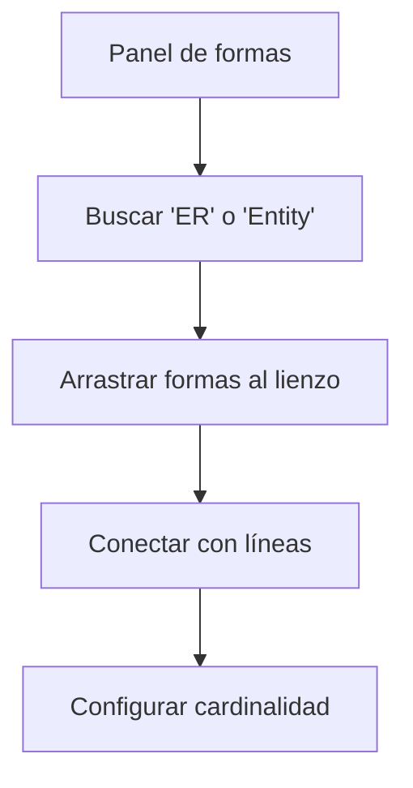
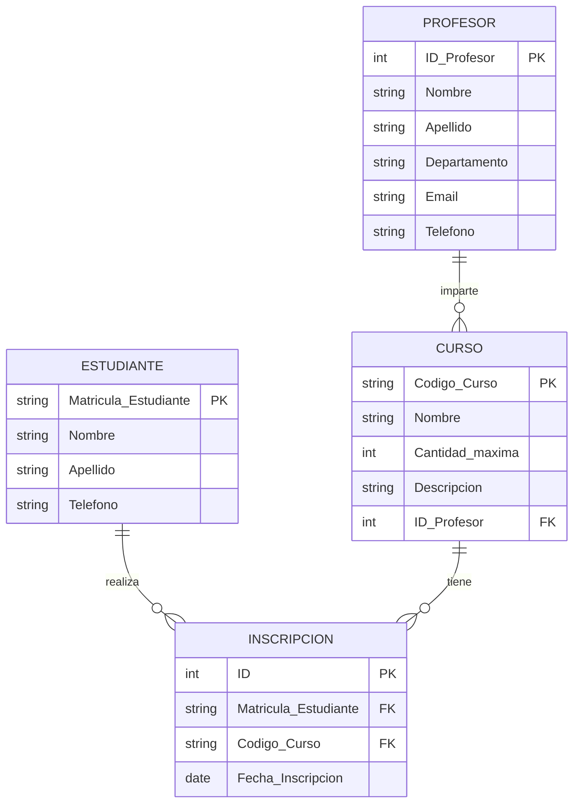

<div align="center">
  <h1>Clase 1: Diseño de bases de datos mediante modelado Entidad-Relación</h1>

## Diagramas Entidad-Relación con draw.io


_Fundamentos del modelado conceptual de bases de datos_

</div>

---

## Objetivo de la clase

Al finalizar esta clase, serás capaz de:

- Comprender los conceptos fundamentales del modelo Entidad-Relación **(ER)**
- Identificar y modelar entidades, atributos y relaciones
- Representar correctamente la cardinalidad entre entidades
- Crear diagramas ER usando draw.io
- Conocer las reglas básicas para convertir un diagrama ER en tablas

---

## Elementos fundamentales del modelo ER

Un diagrama ER es un dibujo que representa la estructura de una base de datos antes de crearla. Es como el plano de una casa: primero diseñas y luego construyes.

### 1. Entidades

Las entidades representan **cosas u objetos** del mundo real sobre los cuales queremos guardar información.

| Elemento           | Descripción                            | Ejemplo                    |
| ------------------ | -------------------------------------- | -------------------------- |
| **Entidad Fuerte** | Existe por sí sola, no depende de otra | `Estudiante`, `Producto`   |
| **Entidad Débil**  | Solo existe si otra entidad existe     | `Teléfono` (de `Empleado`) |

**En draw.io:** Busca "Entity" en la librería de formas o usa un rectángulo simple.

**Explicación sencilla:** Si puedes decir "quiero guardar información sobre _esto_", entonces _esto_ es una entidad. Por ejemplo: "quiero guardar información sobre **estudiantes**" → `Estudiante` es una entidad.

### 2. Atributos

Son las **características o propiedades** de una entidad. Describen qué información guardamos de cada entidad.

| Tipo de Atributo | Descripción                        | Ejemplo en `Estudiante`         |
| ---------------- | ---------------------------------- | ------------------------------- |
| **Simple**       | Un solo valor, no se puede dividir | `Edad`                          |
| **Compuesto**    | Se puede dividir en partes         | `Dirección` (calle, ciudad, CP) |
| **Derivado**     | Se calcula a partir de otros       | `Edad` (de `FechaNacimiento`)   |
| **Clave**        | Identifica de forma única          | `Id Matricula`                  |
| **Multivaluado** | Puede tener múltiples valores      | `Teléfonos`                     |

**En draw.io:** Usa elipses (óvalos) conectados a la entidad.

**Explicación sencilla:** Si la entidad fuera una persona, los atributos serían sus datos: nombre, edad, correo, teléfono, etc.

### 3. Relaciones

Son las **conexiones o asociaciones** entre dos o más entidades. Indican cómo se relacionan las entidades entre sí.

| Tipo          | Descripción                   | Ejemplo                         |
| ------------- | ----------------------------- | ------------------------------- |
| **Binaria**   | Entre dos entidades           | `Estudiante` - `Curso`          |
| **Recursiva** | Una entidad consigo misma     | `Empleado` supervisa `Empleado` |
| **Ternaria**  | Entre tres entidades          | `Estudiante`-`Profesor`-`Curso` |

**En draw.io:** Usa líneas para conectar entidades. Opcionalmente, agrega un rombo en el medio con el nombre de la relación.

**Explicación sencilla:** Una relación responde a la pregunta "¿cómo se conecta _esto_ con _aquello_?". Por ejemplo: un estudiante **se inscribe** en un curso.

---

## Cardinalidad y modalidad

### ¿Cuántos? - Cardinalidad

La cardinalidad define **cuántos elementos** de una entidad se pueden asociar con otra. Es la pregunta: "¿cuántos de A pueden estar relacionados con B?"

| Notación | Símbolo | Significado     | Ejemplo                                         |
| -------- | ------- | --------------- | ----------------------------------------------- |
| **1:1**  | `┼───┼` | Uno a Uno       | Una persona tiene un solo pasaporte             |
| **1:N**  | `┼───<` | Uno a Muchos    | Un profesor imparte muchos cursos               |
| **N:1**  | `>───┼` | Muchos a Uno    | Muchos empleados pertenecen a un departamento   |
| **M:N**  | `>───<` | Muchos a Muchos | Muchos estudiantes se inscriben en muchos cursos |

### ¿Obligatorio? - Modalidad

La modalidad define si la relación **es obligatoria o no**. Es la pregunta: "¿es necesario que exista esta relación?"

| Notación  | Símbolo | Significado                              |
| --------- | ------- | ---------------------------------------- |
| **(0,1)** | `○───`  | Opcional (puede o no existir la relación) |
| **(1,1)** | `───`   | Obligatorio (siempre debe existir)        |

**Ejemplo completo:** `(0,N)` significa: mínimo 0 (opcional), máximo muchos.

---

## Convertir de diagrama ER a esquema relacional

_Nota: Se hablará con más detalle en la siguiente clase._

### Reglas de transformación (resumen)

| Elemento del diagrama ER     | Se convierte en...                |
| ---------------------------- | --------------------------------- |
| Entidad                      | Tabla                             |
| Atributo                     | Columna                           |
| Atributo clave               | PRIMARY KEY                       |
| Relación 1:N                 | FOREIGN KEY en la tabla del lado "N" |
| Relación M:N                 | Nueva tabla intermedia            |

---

## Tutorial: Creando un diagrama ER en draw.io

### Paso 1: Configuración inicial

1. Accede a [app.diagrams.net](https://app.diagrams.net/) o descarga la aplicación
2. Selecciona "Crear nuevo diagrama"
3. Elige "Blank Diagram" o "Entity Relationship"

### Paso 2: Usando las formas ER


```mermaid
flowchart TD
    A[Panel de formas] --> B[Buscar 'ER' o 'Entity']
    B --> C[Arrastrar formas al lienzo]
    C --> D[Conectar con líneas]
    D --> E[Configurar cardinalidad]
```

### Paso 3: Librerías recomendadas

1. **Formas básicas:** Para rectángulos (entidades)
2. **General:** Para elipses (atributos)
3. **Arrow:** Para relaciones y cardinalidades
4. **Entity Relationship:** (si está disponible)

### Paso 4: Mejores prácticas de diseño

- **Alinea** los elementos usando las guías
- **Agrupa** entidades relacionadas
- **Usa colores** consistentes (ej: azul para entidades, verde para atributos)
- **Añade texto descriptivo** en las relaciones
- **Exporta** como PNG o PDF para compartir

---

## Ejemplo práctico: inscripción de materias

### Requerimientos

1. Un **estudiante** puede inscribirse en muchos **cursos**
2. Un **curso** tiene muchos **estudiantes**
3. Cada **curso** es impartido por un **profesor**
4. Un **profesor** puede impartir varios cursos
5. Cada **estudiante** tiene una **matrícula**
6. Cada **curso** tiene un **código único**

### Paso a paso en draw.io

**1. Crear las entidades:**

```
[Estudiante]    [Curso]    [Profesor]
```

**2. Añadir atributos clave:**

- ESTUDIANTE

  - Matricula_Estudiante **(PK)**
  - Nombre
  - Apellido
  - Telefono

- PROFESOR

  - ID_Profesor **(PK)**
  - Nombre
  - Apellido
  - Departamento
  - Email
  - Telefono

- CURSO

  - Codigo_Curso **(PK)**
  - Nombre
  - Descripción
  - Cantidad_maxima
  - ID_Profesor **(FK)**

- INSCRIPCION (tabla intermedia para relación M:N)
  - ID **(PK)**
  - Matricula_Estudiante **(FK)**
  - Codigo_Curso **(FK)**
  - Fecha_Inscripcion

**3. Establecer relaciones:**

```
    Estudiante ───< Inscripción >─── Curso  (M:N)
        Un estudiante puede inscribirse en muchos cursos (0,N)
        Un curso puede tener muchos estudiantes inscritos (0,N)

    Profesor ───< Curso  (1:N)
        Un profesor puede impartir muchos cursos (0,N)
        Un curso es impartido por un solo profesor (1,1)
```

**4. Especificar cardinalidad:**

```
    Estudiante (0,N) ─── Inscripción ─── (0,N) Curso
    Profesor (1,1) ───< (0,N) Curso
```

### Diagrama resultante


```mermaid
erDiagram
    ESTUDIANTE {
        string Matricula_Estudiante PK
        string Nombre
        string Apellido
        string Telefono
    }

    CURSO {
        string Codigo_Curso PK
        string Nombre
        int Cantidad_maxima
        string Descripcion
        int ID_Profesor FK
    }

    PROFESOR {
        int ID_Profesor PK
        string Nombre
        string Apellido
        string Departamento
        string Email
        string Telefono
    }

    INSCRIPCION {
        int ID PK
        string Matricula_Estudiante FK
        string Codigo_Curso FK
        date Fecha_Inscripcion
    }

    ESTUDIANTE ||--o{ INSCRIPCION : "realiza"
    CURSO ||--o{ INSCRIPCION : "tiene"
    PROFESOR ||--o{ CURSO : "imparte"
```

---

## Ejercicio práctico

### Caso: Sistema de Biblioteca

**Requerimientos:**

1. Los **libros** tienen ISBN, título y autor
2. Los **miembros** tienen ID, nombre y fecha de inscripción
3. Un **miembro** puede pedir prestados muchos **libros**
4. Un **libro** puede ser prestado a muchos **miembros** (en diferentes momentos)
5. Cada **préstamo** registra fecha de préstamo y devolución

### Tu tarea

1. Identifica las entidades y sus atributos
2. Determina las relaciones y cardinalidades
3. Crea el diagrama ER en draw.io

_Nota: puedes ayudarte de esta documentación: [Diagramas ER](https://www.processon.io/es/blog/er-diagram-tutorials)_

---

## Recursos adicionales

### Documentación oficial

- [Draw.io Tutorial - Entity Relationship](https://www.youtube.com/watch?v=fYGaXuclxas)
- [Simbología ER estándar](https://en.wikipedia.org/wiki/Entity–relationship_model)

### Plantillas útiles en draw.io

1. File > New from Template > Software > Entity Relationship
2. Format panel > Style > Presets

### Extensiones recomendadas

- **draw.io Integration** para VS Code
- **draw.io Diagrams** para Confluence

---

<div align="center">

_Has completado la clase de modelado ER. En la siguiente clase aprenderás a transformar estos diagramas en esquemas relacionales listos para implementar._

**Recuerda:** Un buen diseño ER ahorra horas de desarrollo futuro.

</div>
