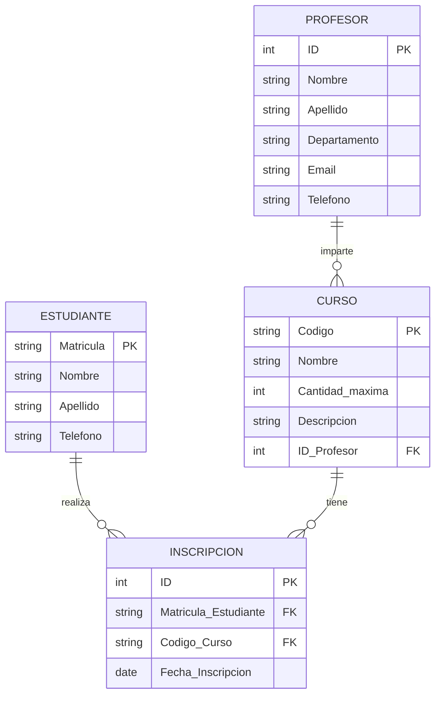

# 📋 **Análisis y Corrección del Ejercicio de Inscripción de Materias**

## 🔍 **Errores Identificados:**

### **1. Inconsistencias en el modelo ER:**

- **Matrícula** aparece como entidad en algunos lugares y como relación en otros
- **Cardinalidades incorrectas** en la relación Estudiante-Curso
- **Falta claridad** en la transformación del modelo ER a relacional

### **2. Problemas específicos:**

#### **En la descripción inicial:**

- Se menciona que cada estudiante tiene una matrícula, pero luego se modela como entidad separada
- La relación M:N entre Estudiante y Curso se resuelve con Matrícula como entidad intermedia, pero no se especifica correctamente

#### **En el diagrama:**

- Se muestra una relación directa "INSCRIBE" entre Estudiante y Curso, pero en la descripción se usa Matrícula como tabla intermedia
- La cardinalidad (0,N)─(0,N) entre Estudiante y Curso no refleja el uso de la tabla Matrícula

#### **En el esquema SQL:**

- La tabla `Inscripcion` aparece sin previo aviso en el modelo ER
- Falta coherencia entre los nombres usados en el ER y en el SQL
- No se menciona el atributo `Cantidad maxima` en la tabla Curso del SQL

---

## ✅ **Versión Corregida:**

## 📚 **Ejemplo Práctico: Inscripción de Materias (Corregido)**

### **📝 Modelo ER Corregido:**

#### **1. Entidades y Atributos:**

```
ESTUDIANTE
- Matricula (PK)
- Nombre
- Apellido
- Telefono

CURSO
- Codigo (PK)
- Nombre
- Cantidad_maxima
- Descripcion
- ID_Profesor (FK)

PROFESOR
- ID (PK)
- Nombre
- Apellido
- Departamento
- Email
- Telefono

INSCRIPCION (tabla intermedia para relación M:N)
- ID (PK) [opcional, se pueden usar las FKs como PK compuesta]
- Matricula_Estudiante (FK)
- Codigo_Curso (FK)
- Fecha_Inscripcion
```

#### **2. Relaciones Corregidas:**

```
Estudiante ───< Inscripción >─── Curso  (M:N)
Un estudiante puede inscribirse en muchos cursos (0,N)
Un curso puede tener muchos estudiantes inscritos (0,N)

Profesor ───< Curso  (1:N)
Un profesor puede impartir muchos cursos (0,N)
Un curso es impartido por un solo profesor (1,1)
```

#### **3. Cardinalidades Correctas:**

```
Estudiante (0,N) ─── Inscripción ─── (0,N) Curso
Profesor (1,1) ───< (0,N) Curso
```

### **🖼️ Diagrama ER Corregido:**



### **🗃️ Esquema Relacional Corregido:**

```sql
-- Tablas principales
CREATE TABLE Estudiante (
    Matricula VARCHAR(20) PRIMARY KEY,
    Nombre VARCHAR(50) NOT NULL,
    Apellido VARCHAR(50) NOT NULL,
    Telefono VARCHAR(15)
);

CREATE TABLE Profesor (
    ID INT PRIMARY KEY,
    Nombre VARCHAR(50) NOT NULL,
    Apellido VARCHAR(50) NOT NULL,
    Departamento VARCHAR(50) NOT NULL,
    Email VARCHAR(100) UNIQUE,
    Telefono VARCHAR(15)
);

CREATE TABLE Curso (
    Codigo VARCHAR(10) PRIMARY KEY,
    Nombre VARCHAR(100) NOT NULL,
    Cantidad_maxima INT DEFAULT 30,
    Descripcion TEXT,
    ID_Profesor INT NOT NULL,
    FOREIGN KEY (ID_Profesor) REFERENCES Profesor(ID)
        ON UPDATE CASCADE
        ON DELETE RESTRICT
);

-- Tabla intermedia para relación M:N
CREATE TABLE Inscripcion (
    Matricula_Estudiante VARCHAR(20),
    Codigo_Curso VARCHAR(10),
    Fecha_Inscripcion DATE DEFAULT CURRENT_DATE,
    PRIMARY KEY (Matricula_Estudiante, Codigo_Curso),
    FOREIGN KEY (Matricula_Estudiante) REFERENCES Estudiante(Matricula)
        ON UPDATE CASCADE
        ON DELETE CASCADE,
    FOREIGN KEY (Codigo_Curso) REFERENCES Curso(Codigo)
        ON UPDATE CASCADE
        ON DELETE CASCADE
);

-- Índices para mejorar el rendimiento
CREATE INDEX idx_curso_profesor ON Curso(ID_Profesor);
CREATE INDEX idx_inscripcion_estudiante ON Inscripcion(Matricula_Estudiante);
CREATE INDEX idx_inscripcion_curso ON Inscripcion(Codigo_Curso);
```

### **📊 Consultas de Ejemplo:**

```sql
-- Ver estudiantes inscritos en un curso específico
SELECT e.Matricula, e.Nombre, e.Apellido, i.Fecha_Inscripcion
FROM Estudiante e
JOIN Inscripcion i ON e.Matricula = i.Matricula_Estudiante
WHERE i.Codigo_Curso = 'MAT101';

-- Ver cursos impartidos por un profesor
SELECT c.Codigo, c.Nombre, c.Cantidad_maxima,
       COUNT(i.Matricula_Estudiante) as Inscritos
FROM Curso c
LEFT JOIN Inscripcion i ON c.Codigo = i.Codigo_Curso
WHERE c.ID_Profesor = 1
GROUP BY c.Codigo, c.Nombre, c.Cantidad_maxima;

-- Ver profesores y sus cursos
SELECT p.Nombre, p.Apellido, p.Departamento,
       c.Codigo, c.Nombre as Curso_Nombre
FROM Profesor p
JOIN Curso c ON p.ID = c.ID_Profesor
ORDER BY p.Apellido, p.Nombre;
```

---

## 🔑 **Puntos Clave de la Corrección:**

1. **Consistencia**: Se unificó el término "Inscripción" para la tabla intermedia
2. **Claridad**: Se definieron explícitamente las relaciones y cardinalidades
3. **Completitud**: Se incluyeron todos los atributos mencionados en los requerimientos
4. **Normalización**: Se respetaron las formas normales básicas
5. **Integridad referencial**: Se añadieron claves foráneas con acciones específicas

Esta versión corregida es coherente, completa y lista para implementación en un sistema real de gestión académica.
